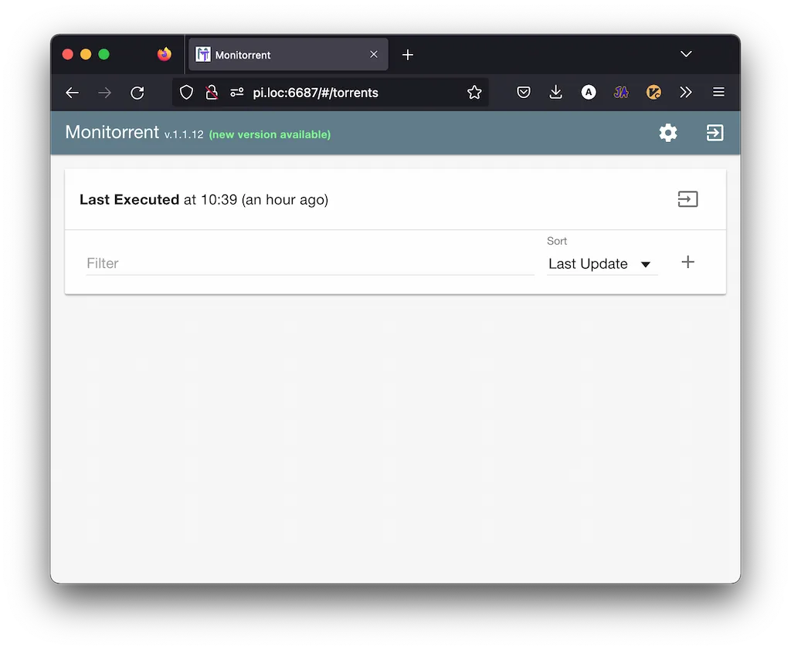
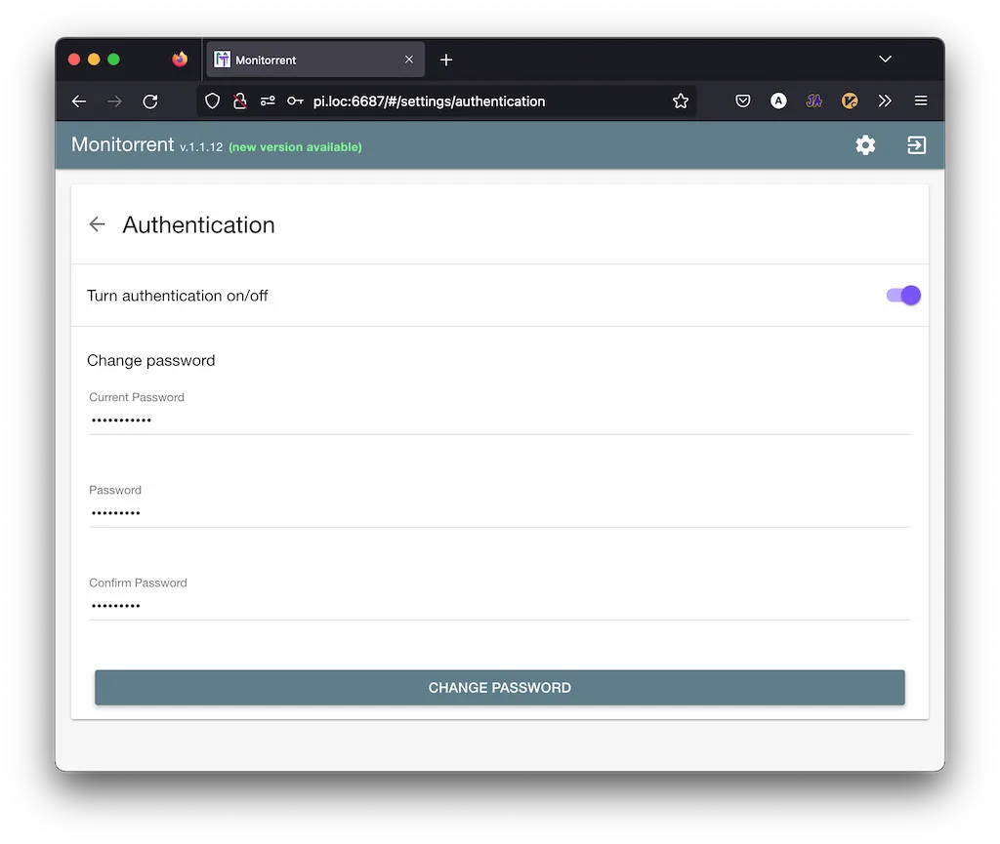
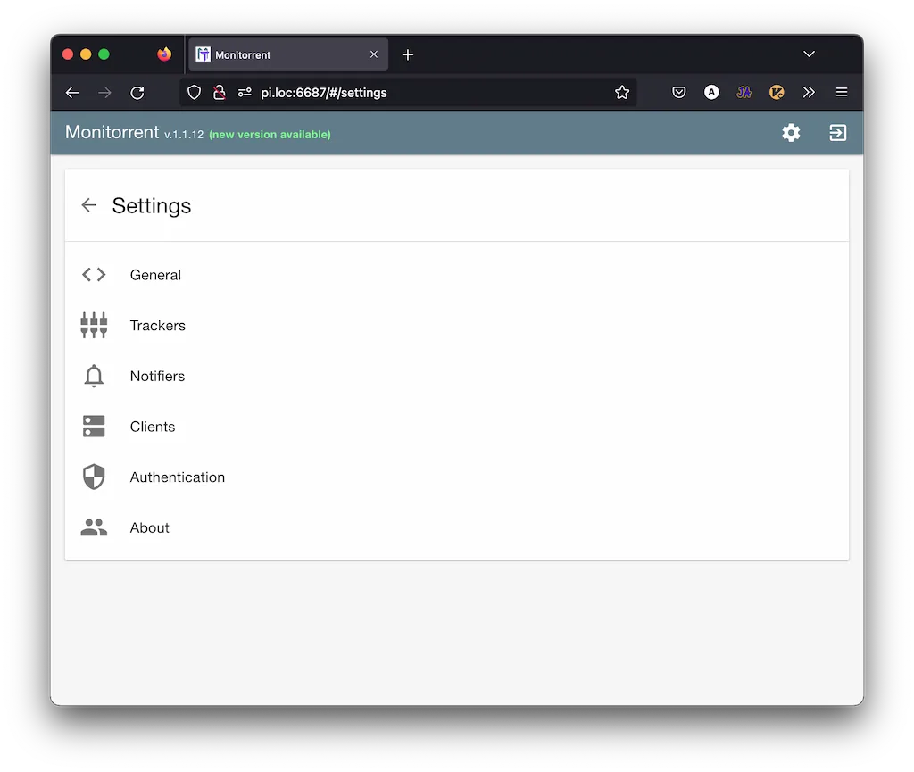
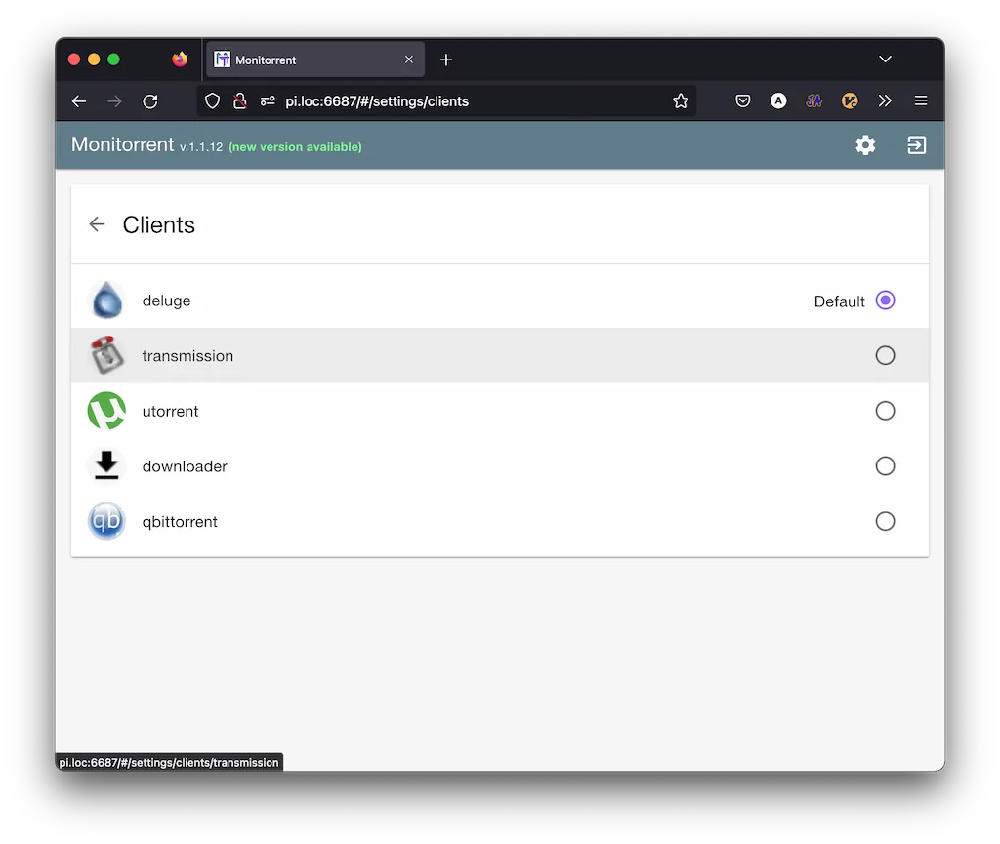
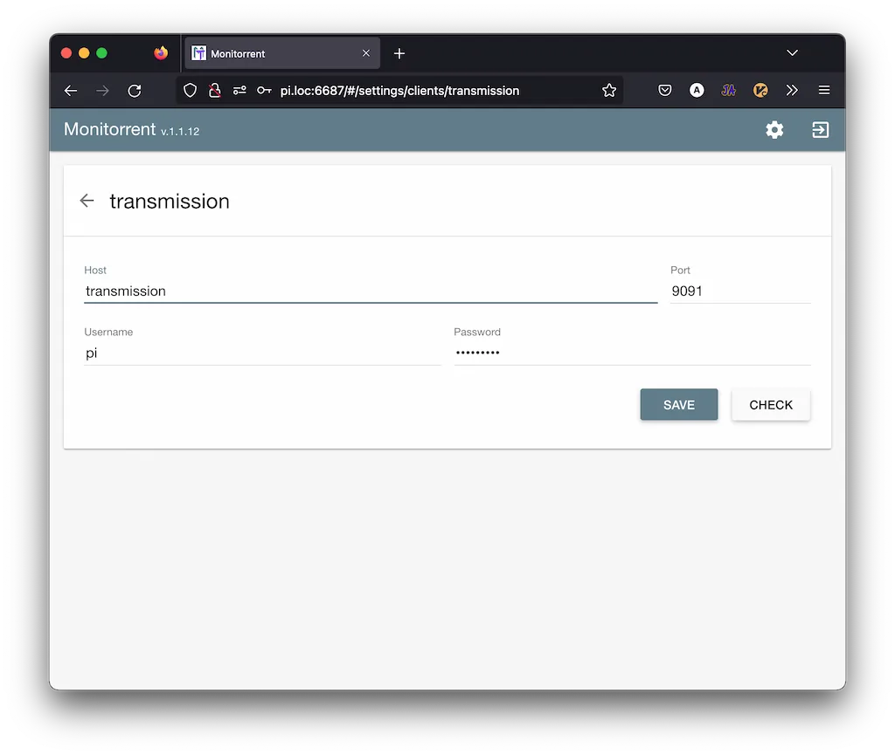
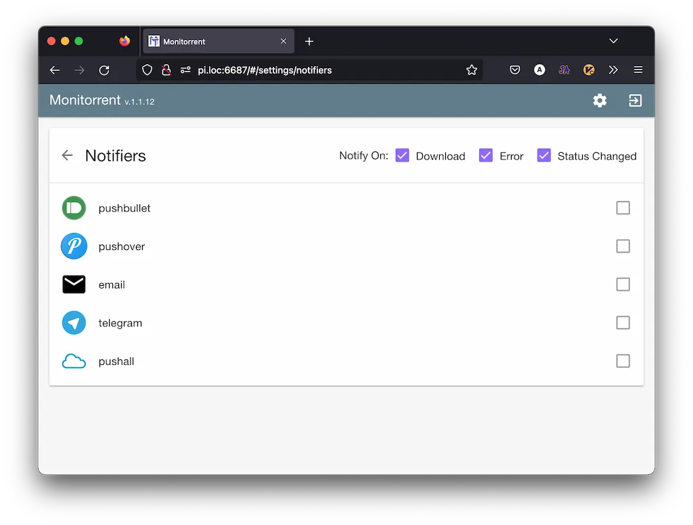

---
seo:
  title: 🍊 Настройка Monitorrent на Orange PI
  description: Настройка автоматического скачивания сериалов на Orange PI. Настройка Docker для автоматизации скачивания.
  date: 2022-11-08
  image: /images/graph/avil13-graph-bg-orange.jpg
hero:
  src: /images/graph/blog/orange-2.webp
  alt: Настройка Monitorrent на Orange PI
---

# Настройка Monitorrent на Orange PI

<div class="list-of-parts">
  <a href="/blog/2022/07-home-pi-server/">Часть 1</a>
  <a href="/blog/2022/08-pi-monitorrent/" class="active">Часть 2</a>
</div>


В предыдущей статье, разобрались как с нуля настроить сервачёк на Orange PI, накатить на него основные программы.

Эту статью увидел мой добрый товарищ и посоветовал добавить [monitorrent](https://github.com/werwolfby/monitorrent), что бы он следил за нужными мне торрент-ссылками, и автоматом делал скачивание новых серий.

> Так как `heimdall` у меня был поднят в docker контейнере, то что бы не городить зоопарк, добавим контейнер с `monitorrent` в тот же docker-compose файл.

И так как у нас уже есть работающий `docker`, то `monitorrent` - будем устанавливать через него.

`transmission` - который установили ранее удалим и тоже поставим через `docker`. Нужно это что бы `monitorrent` имел к нему доступ.

## Удаляем transmission

```bash
sudo su
apt purge transmission transmission-common
```

## Устанавливаем все через docker

> У меня папка с docker-compose.yml называется "heimdall" - вы можете назвать как удобно, мне просто лень переименовывать.

```bash
# Заходим в папку с docker-compose.yml
cd ~/heimdall
# создаем файл для sqlite базы данных
mkdir monitorrent && touch monitorrent/monitorrent.db
# редактируем файл конфигурации
vim docker-compose.yml
```

```yaml
version: '3'
networks: # сеть нам нужна, что бы контейнеры смогли общаться друг с другом
  backend:
    driver: bridge

services:
  heimdall:
    image: linuxserver/heimdall
    container_name: heimdall
    environment:
      - PUID=1000
      - PGID=1000
      - TZ=Europe/Moscow
    volumes: # общие папки - "наша:контейнера"
      - ./config:/config
    ports: # Список портов через которые будет доступен интерфейс в браузере - "внешний:внутренний"
      - 80:80
      - 443:443
    restart: unless-stopped # Контейнер будет автоматически рестартовать, до тех пор пока вы не отсановите его вручную
    networks: # внутренняя сеть
      - backend

  monitorrent:
    image: werwolfby/armhf-alpine-monitorrent
    container_name: monitorrent
    ports:
      - 6687:6687
    volumes:
      - ./monitorrent/monitorrent.db:/var/www/monitorrent/monitorrent.db
    restart: unless-stopped
    networks:
      - backend

  transmission:
    image: linuxserver/transmission
    container_name: transmission
    environment:
      - PUID=1000
      - PGID=1000
      - TZ=Europe/Moscow
      - USER=pi   # логин пароль можно не ставить
      - PASS=secret
    volumes:
      - ./transmission/config:/config
      - ./transmission/downloads:/downloads
      - ./transmission/watch/:/watch
    ports:
      - 9091:9091
      - 51413:51413
      - 51413:51413/udp
    restart: unless-stopped
    networks:
      - backend
```

Теперь рестартуем докер.

```bash
# получаем права супер пользователя
sudo su
# останавливаем докер
docker-compose down
# поднимаем докер снова
docker-compose up -d
```

Как помните у меня алиас на мой сервер записан как `pi.loc` поэтому проходим по адресу `http://pi.loc:6687/login` и авторизуемся.



По умолчанию пароль `monitorrent` при желании его можно поменять в настройках.



Далее идём в настройки



Подключаем клиент `transmission` что бы прокидывать в него новые торренты.



Так как они работают в докере, то хост это имя контейнера.



При желании можно добавить уведомления в удобном для вас мессенджере, и получать информацию о появлении новой серии в настроенной ссылке для слежения.



И все это было сделано, потому что `monitorrent` умеет следить за данными ему по ссылкам торрентами.
И автоматом их обновлять, и сообщать об этом тебе, мой дорогой пользователь.


